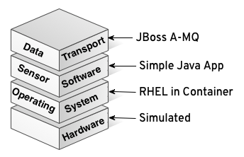
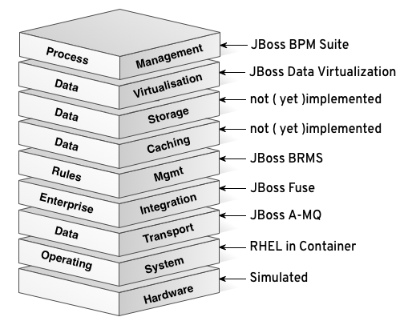
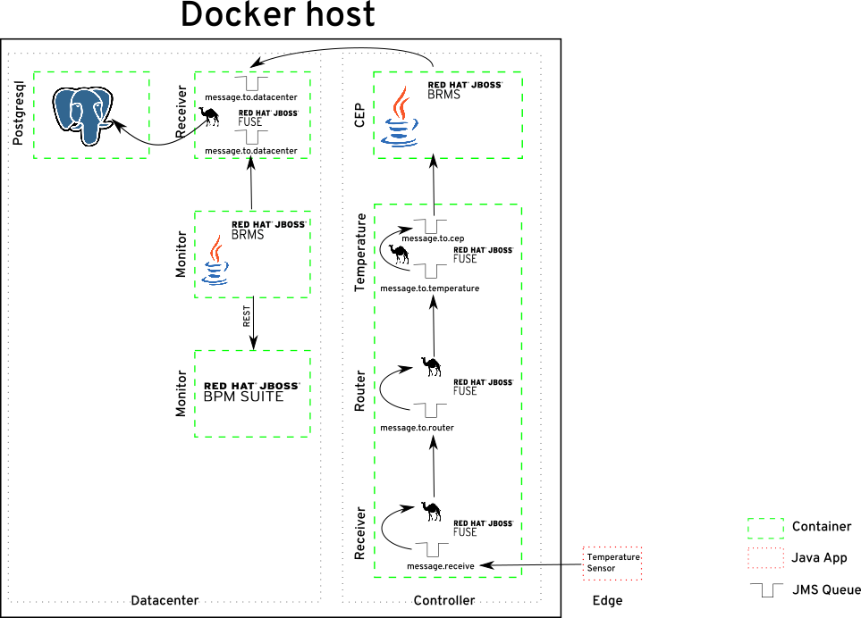

= IoT Demo

:Author:    Patrick Steiner
:Email:     psteiner@redhat.com
:Date:      30.05.2015

:toc: macro

toc::[]

== What it's all about
This demo is supposed to show a lab-based version of a typical Internet of Things ( IoT )
setup. It follows a 3-Layered architecture of

* Edge: as created of data
* Controller: first level of data processing
* Datacenter: well, the datacenter ...

These layers can - and in this demo will - be made out of a set of
Red Hat JBoss products, each taking over an important part in the IoT landscape

image::./pictures/iot.png[]

== What has been implemented?
As for now, this demo includes:

 * 1 edge device, which simulates a temperature sensor
  ** light, randomly changed values
  ** choose between XML and CSV dataformat
  ** choose between Fahrenheit and Celsius
 * controller functionality to
  ** transformation of edge message to a XML format ( not yet needed )
  ** route message based on source to be able to apply different procedures
  ** if temperature is received in Fahrenheit, then if will be transformed to Celsius
  ** complex event processing to filter messages
 * datacenter functionality to
  ** apply business rules to decide if data is important and needs saving
  ** store selected data in a Postgresql database
  ** validate data agains business rules and create Human-Task based alert if required
  ** provide a graphical business dashboard to see data

Communication between edge and controller, as well as controller internal communication
is implemented via JMS messaging.

=== Edge Domain

For this demo, I implemented a simple dummy sensor, which can be used to create
 data like from a temperature-sensor, pressure-sensor, etc.

As of now, it works with the following steps:

 1. start with an initial value ( 70 in this case )
 2. send data record via JMS to Controller
 3. alter data
   * get random number between 1 and 1000
   * if random number is <= 10 reduce data by 1
   * if random number is >= 990 increase data by 1
 4. back to 2.

You can choose if the messages are supposed to be delivered

 * as XML or CSV
 * in Celsius or Fahrenheit

=== Controller

The controller does the following

 1. receive data record via JMS
 2. transform data from sensor-specific format to xml, if delivered as CSV
 3. route data based on sensor type
 4. use complex event processing ( CEP ) to filter messages. Currently we only
       have one rule, which deletes messages if the value is the same as in the
       previous message.
 5. send data record via JMS to datacenter

All functionality for the controller is implemented with http://www.redhat.com/de/technologies/jboss-middleware/fuse-service-works[Red Hat JBoss Fuse Service Works], with every step packaged in its own container.

=== Datacenter

As for now, the datacenter is implemented with the following service,
each running in it's own container

 1. receive messages from the controller
 2. store the received data in a database ( Postgresql )
 3. forward message to a monitor, who checks the data if an alert needs to be raised. This alert
 is implemented by starting business-process with a human task.
 4. provide graphical dashboard to see data

== Runtime Environment
The entire functionality is divided into various services, each running in its
own Docker container.

== Prerequisites

=== Dockerhost
The entire demo is build on https://www.docker.com/[Docker]. The various elements all run in their own container.

Please do follow the instructions on how to install Docker on your host, based on the https://docs.docker.com/installation/[relevant pages] from Docker.com

=== Docker Compose
For the first time I have used docker-compose as a tool to help me getting things up and running.
To be honest, it helped a lot.

Please follow the instructions on https://docs.docker.com/compose/[Docker-Compose] on how to install docker-compose on your system.

=== Maven
As our installation procedure will build a few jars for you convenience,
please do have the appropriate tools up and running on your Docker host.

== Building the Demo Environment

=== Getting the code

The procedure to build the various requried Docker container has been automated for your convenience,
all you need to do is to clone the most current version of the demo from github
----
git clone https://github.com/PatrickSteiner/Iot_Demo_Fuse
----

=== Providing the Red Hat JBoss Products
I have not included the various JBoss products in the git repository, so it will be your obligation to retrieve them and to place them in their directories.

	* ` jboss-fuse-full-6.2.0.redhat-133.zip` into `./Fuse/Docker_Files/software`
  * `jboss-dv-installer-6.1.0.redhat-3.jar` into `./iot_datacenter_dashboard/Docker_Files/software`
  * `boss-bpmsuite-6.1.0.GA-deployable-eap6.x.zip` into `./iot_datacenter_bpm/Docker_Files/software`
  * `jboss-eap-6.4.0.zip` into `./iot_datacenter_bpm/Docker_Files/software`

If you are a developer, you can download the products from http://www.jboss.org[JBoss.org]. If you are
are Red Hat customer, do so from the http://access.redhat.com[Customer Portal].

=== Building the demo
I have tried to make the deployment of the entire IoT Demo as convenient as possibe.
All you need to do is

  * make sure you have all required pre-requisites
  * downloaded and places the required Red Hat products into the documented directories
  * run `./build.sh`

== Starting the environment

**Please note that you should have at least 12GB memory to run this environment
on one server!**

Once you have completed the previous step, you can run the demo in your own
environment. Simply use `./docker-compose up` to start all images with the
required parameter and configurations.

After successful launch of all container, you can use your browser to view
the following dashboads

[width="80%",frame="topbot",options="header,footer"]
|======================
|URL | Service | User / Password
|http://localhost:10000/hawtio | Controller-Receiver Management Console | admin / admin
|http://localhost:10001/hawtio | Controller-Router Management Console | admin / admin
|http://localhost:10002/hawtio | Controller-Temperature Management Console | admin / admin
|http://localhost:10003/hawtio | Datacenter-Receiver Management Console | admin / admin
|http://localhost/phpPgAdmin/ | phpPGAdmin on DB-Server | psteiner / change12_me
|http://localhost:10004/business-central | JBoss BPM - Business-Central | psteiner / change12_me
|http://localhost:10006/dashboard/ | JBoss Data Virtualization - Dashboard-Builder | dashboardAdmin / change12_me
|======================

== Enabling the Business Process Management Layer

Unfortunately I have not yet found a way to automatically deploy my business processes.
The process and all required artifacts are provided, but need to be deployed into
the runtime container from JBoss BPM Suite.

The following sections will describe the required actions.

 * Logon

 * Go to Authoring panel of BPM Suite

 * Make sure that you selected the correct project and click the `Open Project Editor` button

 * Build and Deploy the project

image::./pictures/BPM_Build.png[]

 * Done!

== Creating testdata
I have tried to create a "general purpose" producer. As of now, he will produce
values based on a simple structure

----
@XmlRootElement(name = "dataSet")
@XmlType(propOrder = { "timestamp", "deviceType", "deviceID", "payload","required" })
public class DataSet {
  private String   timestamp;
  private int      deviceType;
  private int      deviceID;
  private int      payload;
  private int      required;
  private String   unit;
----

There are system properties which you can use to alter the behavior of the client

[width="80%",frame="topbot",options="header,footer"]
|======================
|Name | Function | Default | Options
|deviceType | Type of device to simulate | 1 | 1=temperature
|deviceID | ID of device to simulate | 1 | <any>
|initialValue | value to start simulation with | 70 | <any integer>
|count | How many messages to produce | 1 | <any integer>
|waitime | Seconds to wait between messages | 1 | <any in seconds>
|messageType | XML or CSV based message | XML | "xml" or "csv"
|unit | unit for temperature payload | "C" | "C" or "F"
|======================

For convenience I created a few simple ( very simple ) scripts which do the following

1. `run.sh`
 * 10 messages
 * deviceType = 1, temperature gauge
 * deviceID = 1
 * initialValue = 70
 * waitTime = 1
 * count = 50

2. `run_low.sh`
 * 1 messages
 * deviceType = 1, temperature gauge
 * deviceID = 1
 * initialValue = 50
 * waitTime = 1
 * count = 1

3. `run_multi.sh`
 * deviceType = 1
 * deviceID = 1, temperature gauge
 * initialValue = 70
 * count = 100
 * waitTime = 1
 * ------------------
 * deviceID = 2
 * initialValue = 100
 * ------------------
 * deviceID = 3
 * initialValue = 20

If you want to change the data, please feel free to do so. Up until now, the
Controller-Router will understand the following device types:

[width="80%",frame="topbot",options="header,footer"]
|======================
|ID | Name | Behavior in Demo
|0 | pressure-gauge | will be stored in `message.to.pressure` on Router-Container
|1 | temperature-gauge | will be fully processed
|any other | unknown device | will be stored in `message.to.unknown` on Router-Container
|======================

= To Do

 * Add MQTT based edge
